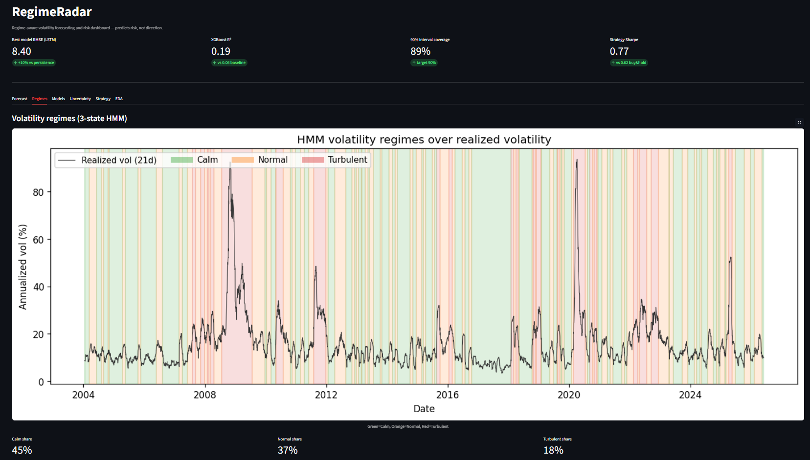
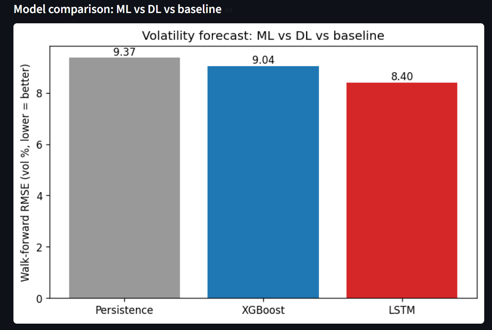
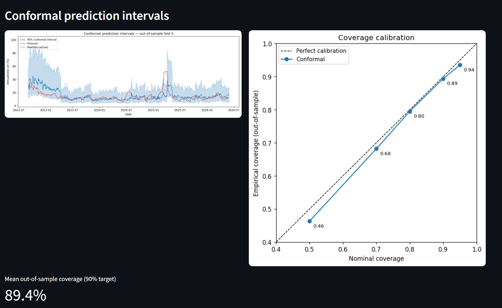
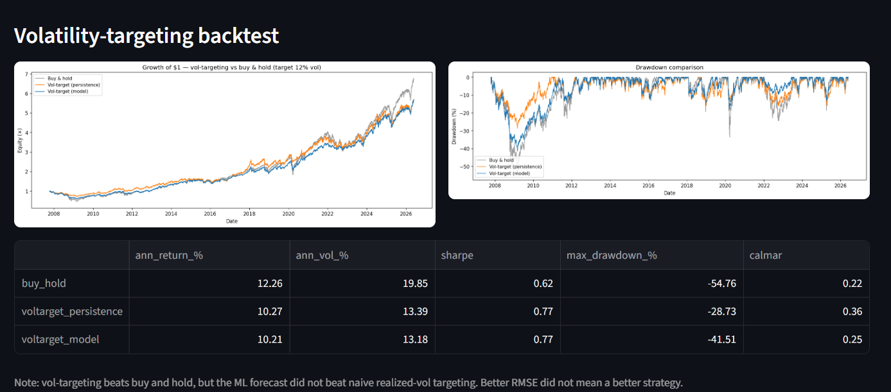
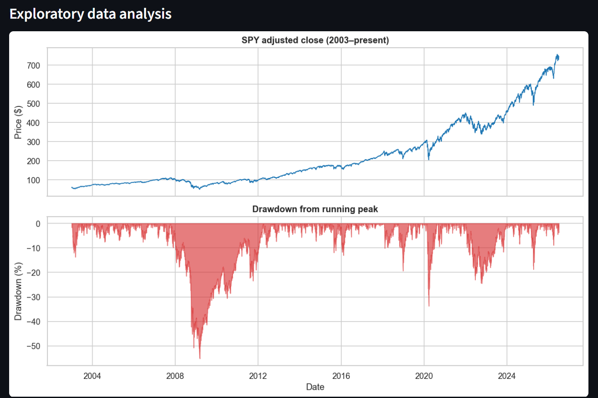
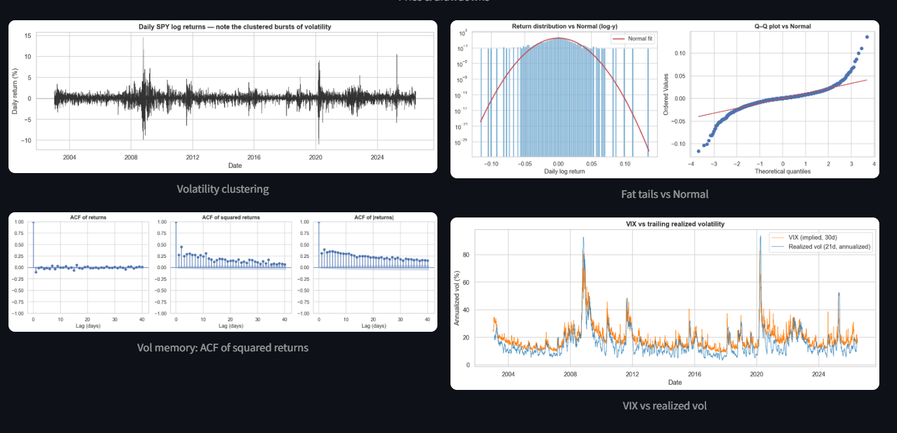

# RegimeRadar

**Regime-aware volatility forecasting and risk dashboard.**

RegimeRadar detects market volatility *regimes*, forecasts near-term **volatility
(risk, not price direction)** with both classical ML and deep learning, attaches
calibrated uncertainty intervals, and validates real-world usefulness through a
backtested volatility-targeting strategy — all surfaced in an interactive dashboard.

> This project predicts **risk, not direction.** There is no price up/down
> classifier anywhere in the pipeline, by design.


---

## Dashboard



---

## Key results

All metrics are **out-of-sample** using time-respecting walk-forward validation
(no random splits, no lookahead).

| Metric | Result | Note |
|---|---|---|
| Forecast error (RMSE) | **8.40** vol pts (LSTM) | **−10%** vs persistence baseline |
| Explained variance (R²) | **0.06 → 0.27** | model vs naive baseline |
| Interval calibration | **89.4%** coverage | on a 90% target, calibrated across all levels |
| Strategy Sharpe | **0.77** vs 0.62 | vol-targeting vs buy & hold |
| Max drawdown | **−55% → −29%** | tail risk nearly halved |

### Model comparison

| Model | RMSE | MAE | R² |
|---|---|---|---|
| Persistence (baseline) | 9.37 | 5.96 | 0.06 |
| XGBoost | 9.04 | 5.73 | 0.19 |
| **LSTM** | **8.40** | **5.25** | **0.27** |



### Calibrated uncertainty

Split-conformal prediction intervals — distribution-free, no Gaussian assumption.
A 90% interval contains the truth 89.4% of the time out-of-sample; the bands widen
in turbulent periods and tighten when calm.



### Strategy backtest

A volatility-targeting overlay (scale exposure inversely to forecast vol) beats
buy & hold on risk-adjusted terms and cuts drawdowns sharply.



> **Honest finding:** vol-targeting beats buy & hold, but the ML forecast did **not**
> beat naive realized-vol targeting. Better point-forecast accuracy did not translate
> into a better strategy — a result worth reporting rather than hiding.

---

## Pipeline

```
raw data → EDA → regime detection → ML forecast → DL forecast
        → uncertainty intervals → backtested strategy → dashboard
```

| Module | What it does |
|---|---|
| `src/data_pipeline.py` | Fetch + cache + align SPY/VIX/TNX and FRED macro, with no-lookahead release-date alignment |
| `notebooks/01_eda.ipynb` | Vol clustering, fat tails, ACF of squared returns, VIX overlay, drawdowns |
| `src/features.py` | Lagged returns, rolling vol, RSI, z-scores, lagged macro, forward-vol target |
| `src/regime_detection.py` | 3-state Gaussian HMM (calm / normal / turbulent) |
| `src/ml_baseline.py` | XGBoost, walk-forward validation, SHAP interpretability |
| `src/dl_model.py` | LSTM (PyTorch), same protocol for a fair ML-vs-DL comparison |
| `src/uncertainty.py` | Conformal prediction intervals + coverage calibration |
| `src/backtest.py` | Vol-targeting vs buy & hold: Sharpe, max drawdown |
| `dashboard/app.py` | Streamlit app tying it all together |





---

## Data (all free, programmatic)

- **yfinance:** `SPY` (OHLCV), `^VIX`, `^TNX` — daily, 2003–present
- **FRED:** `FEDFUNDS`, `CPIAUCSL`, `UNRATE`, `T10Y2Y`

**No-lookahead macro alignment:** FRED macro is monthly and released with a lag
(March CPI is published mid-April). Each series is aligned by the date its value
first became public (FRED vintage / `realtime_start`), then forward-filled onto
trading days — so no future information leaks into the features.

---

## Quickstart

```bash
pip install -r requirements.txt

# FRED API key (free, instant): https://fred.stlouisfed.org/docs/api/api_key.html
cp .env.example .env        # paste your key into .env

# Build the dataset, then run each phase
python -m src.data_pipeline
python -m src.features
python -m src.regime_detection
python -m src.ml_baseline
python -m src.dl_model
python -m src.uncertainty
python -m src.backtest

# Launch the dashboard
streamlit run dashboard/app.py
```

---

## Guardrails

- No price-direction / next-day-return prediction anywhere
- No random train/test splits — time-respecting walk-forward only
- Honest comparisons are deliverables: ML vs DL, regime vs no-regime, strategy vs benchmark
- API pulls are cached locally; never re-fetched on every run
